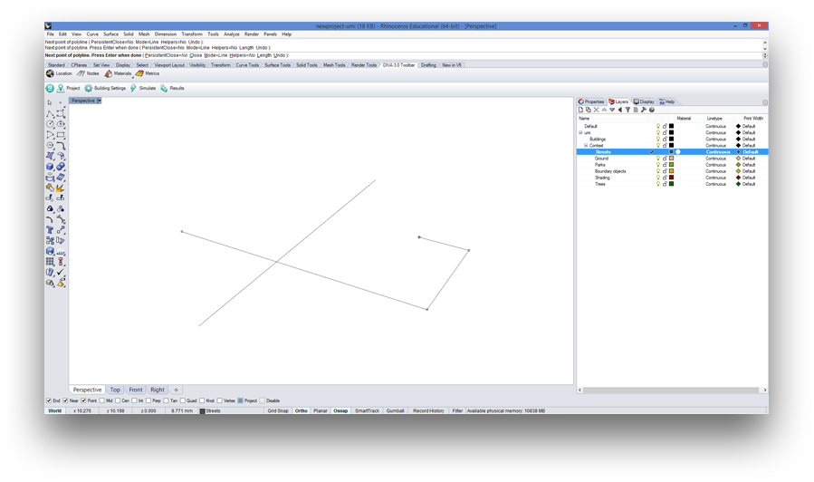
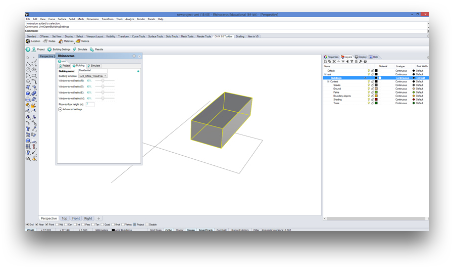
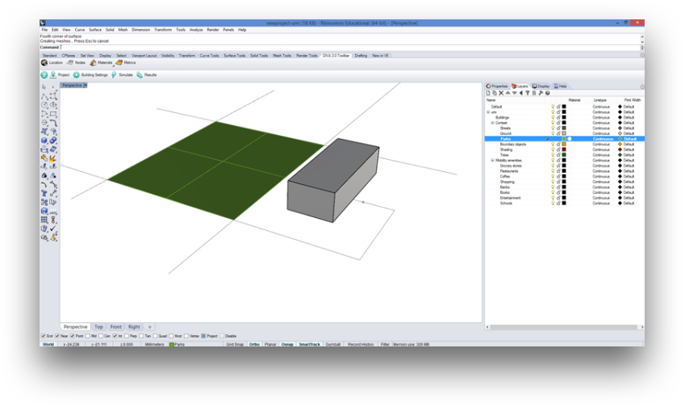

.. _design_access_setup_model:

Setting Up a Rhino Model
========================


.. important:: When creating a new Rhinoceros model for Umi, always use `Meters` as the unit system.

Step 1: Starting a new umi project
----------------------------------

Create a new umi project or start from an existing one. To create a new project, follow the steps detailed in :ref:`setup_model`.

There is no need to set site information or set building information at this point. Click on "Simulate" to setup layers specific to mobility and then on the "Mobility" icon on the left. Click on "Create amenity layers" to generate layers appropriate for mobility simulation.

Step 2: Modeling Streets, Buildings and Amenities
-------------------------------------------------

Streets
```````



   ..

   On the Streets layer, streets can be drawn as any lines, curves or line-like curves.

Buildings
`````````

Building massing can take the form of any Brep, and are placed exclusively on the “Buildings” layer. This should be done by drawing geometry and then setting it up in the settings button. Choose the Brep and click on "Settings" to give the building a name. That is enough for mobility simulation.



   ..

   Draw buildings as Breps.

.. important:: Each Brep has to be connected to the streets network by a path that touches the massing. This is because the algorithm that generates a starting “egress” point for each building searches the start and end points of each curve in the model, and the nearest point becomes a door for the Walkscore simulation. If it is not connected, simulation will run by projecting an egress point to the nearest street, even if not connected.

Amenities
`````````

Amenities are modeled as points on the streets network. They have to be placed precisely on a street curve, However, if they are not they will be projected to the nearest street line. A good tip is to use `"Osnap" <http://docs.mcneel.com/rhino/5/help/en-us/user_interface/object_snaps.htm>`__ to snap to the nearest curve on the streets layer.

.. important:: place amenity points on the streets network, but not on the end of the curve that touches the building massing. This will make the algorithm consider that “start” and “end” points the same, and Walkscore will fail.



   ..

   Amenities are drawn as points and parks as surfaces


The “Parks” amenity is the only amenity modeled as surfaces, and it has to be surrounded with street curves on all sides (regardless of the geometry). If a park is placed as a surface, it is recommended to model it by tracing an empty space between street curves.

Typically a Walkscore simulation will include streets, massings connected to the  streets, amenity points and park surfaces.

Step 3: Running a Simulation
----------------------------

After selecting the "Simulate" button, choose the “Mobility” tab. You can run both the Walkability simulation and the Bikeability Simulation by pressing "Run All." The next section explains how both algorithms work.

Step 4: Results Visualization
-----------------------------

After a simulation runs, a new layer is created with simulation results. This will take the form of false colored buildings.
