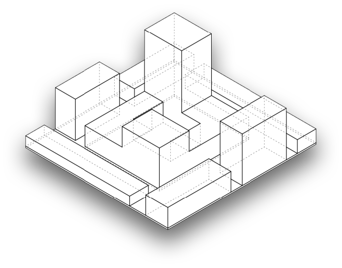
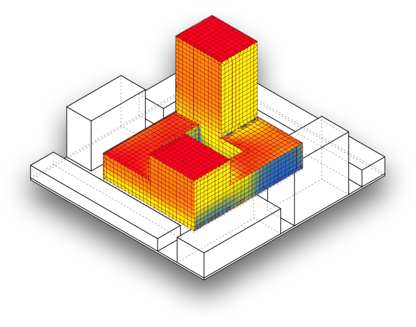
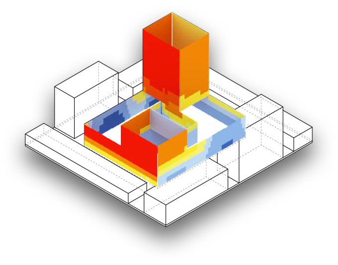

.. _energy-module-overview:

Energy Module Overview
======================

   ..

The operational energy model simulation uses your umi buildings and building template settings as well as the shading geometry on the umi shading layers. A small input geometry example is shown in :numref:`figure_1`.

   ..

First your building envelope is subdivided into floor volumes according to your floor to floor height settings in the building template. Along the facades of each floor volume a solar insolation analysis is performed using Radiance / GenCumulativeSky. Internally your geometry is meshed and then handed over to radiance. :numref:`figure_2` shows a typical result of this insolation simulation.

This radiation data as well as the basic facade surface orientation are then used to cluster facade regions of each building by solar micro climate similarity - see :numref:`figure_3` for an example. Each color represents a cluster.

The number of clusters is a user setting and can be specified for each orientation (a typical cluster count per facade is two)

The Shoeboxer then assigns an area weight to each cluster centroid. This centroid is then also the location for a shoebox model that then represent the cluster. See Figure 4. Each Shoebox or Cluster is written out as IDF file and is simulated with EnergyPlus. The final simulation step is to gather all shoebox data and aggregate the building result. For further details regarding the method please refer to the BS2014 paper online. The method is still under active development and a validation study is on the way.

   This is my figure

   .. image:: assets/energy-module-overview-sjd63jdf8.png
      :scale: 50%

   low - insolation - high
