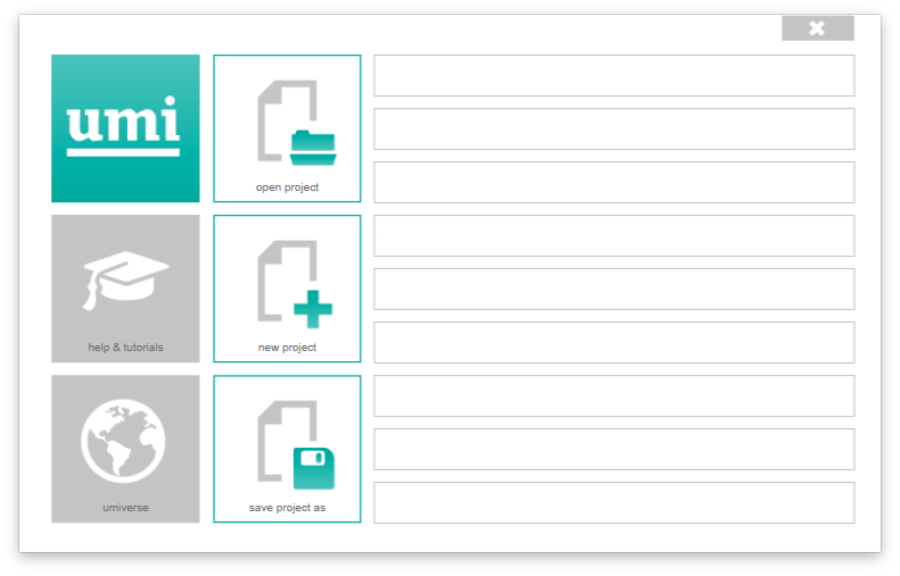

Umi \| First steps
==================

Requirements
------------

Rhinoceros3D version 5-64 bit (Windows only)

Download & Install
------------------

To download UMI,please follow this
`link <http://urbanmodellinginterface.ning.com/page/download>`__ and
fill out the form.

Opening/Creating a project
--------------------------

When working with UMI projects, it is important to use the umi functions
and **NOT** the Rhino commands for “Opening” and “Saving” a project. Umi
creates it’s own file system (\*.umi) which is a package containing all
relevant files and data needed for a project.

To create a new project, simply click on the UMI button and select “open
project” or “new project” and browse to the folder location of your
choice. Once a project has been opened.

   The umi menu

Important: Working units must be in
Meters. To change them, in Rhino, go to > File — Properties — Units —
Model Units : Change to “meters”
