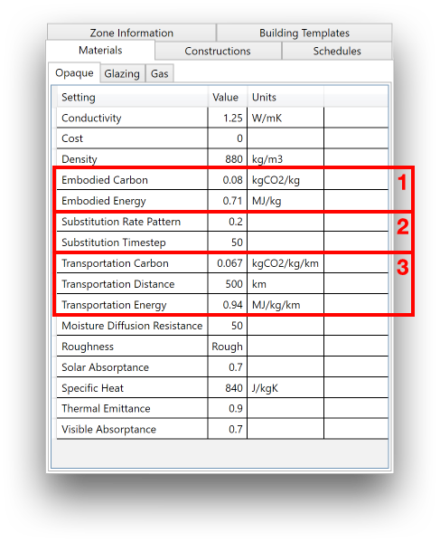
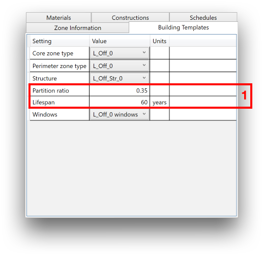

Life Cycle - Data Inputs
========================

Embodied energy and carbon calculations in umi are based on a set of environmental parameters defined in the Template Library File (TLF). The TLF does not only include life cycle data inputs, but many others used in different modules within umi. This user guide only focuses on describing in detail those data inputs required for the Life Cycle module, within Material, Construction, Structure and Building definitions. To know more about the TLF and its management through the Template File Editor you can go to the :ref:`template-editor` section of this user guide. In order to learn about the definition of thermal properties you can go to the :ref:`energy-module-overview` section of the user guide.

Life Cycle data in Opaque/Glazing Materials
```````````````````````````````````````````

All life cycle related inputs within Material components are located in the “Environmental” section. They characterize, for each opaque or glazing entry, the Production, Transport and Maintenance life cycle impacts in terms of Embodied Energy and Carbon.



The first section (1) has two fields: “Embodied Carbon” and “Embodied Energy”. These refer to the impacts in production and manufacture of a kg of the material in question, measured in a Cradle-to-Gate manner. The units selected are the most typical ones in existing databases: MJ/kg for primary energy and kgCO2/kg for carbon. A common and validated reference for these values is the `Inventory of Carbon and Energy (ICE) <http://www.ghgprotocol.org/Third-Party-Databases/Bath-ICE>`__ developed by the university of Bath.

The second section (2) has also two fields and is used to define replacement rates for materials during the lifespan of the building. “Substitution Step” is defined as the duration in years of a period of replacement (e.g. There will be interventions in this material type every 10 years). “Substitution Rate” is a ratio from 0 to 1 which defines the amount of the material replaced at the end of each period of replacement (e.g. Every 10 years this cladding will be completely replaced with ratio 1). Notice that you can define different replacement ratios for different consecutive periods, introducing them separated by commas. For example, if you introduce the series “0.1 , 0.1 , 1” after the first 10 years a 10% will be replaced, then after 20 years another 10%, then after 30 years a 100%, and finally the series would start again in year 40.

The third section (3) is used to define the transport impacts through three inputs. “Transport Distance” refers to the average distance in km from the manufacturing site to the building construction site. “Embodied Energy/Carbon” refer the impacts associated with the transport by km of distance and ton of material. These values are typically defined by vehicle (Truck, Train, Boat, etc.) and size and can be found in fuel efficiency publications.

Life Cycle data in Structure Constructions
``````````````````````````````````````````

The “Structure” component under constructions is an special type of construction not associated to any particular geometry component in a building, but the complete structural material system defined by m\ :sup:`2` of floor area. It is exclusively used in life cycle calculations and is defined in three main sections: “Typology information”, “Materials” and “Environmental”. The first (1) includes data only to be used for structures classification matters in this version and has no implication in calculations.

.. figure:: ./assets/lifecycle-templateinput-d94j7dj4.png
   :scale: 100 %
   :align: center

The second (2) allows for the definition of the different materials within the structure type (e.g. Concrete and Steel in a reinforced concrete structure). You can add a new material by clicking in the first empty Material cell and selecting form the list. Then define the amount of that material per m\ :sup:`2` typically present in that type of structure (Normal Ratio). In future versions of umi you will be able to define high load ratio for structures exposed to seismic actions or high winds.

Finally the “Environmental” section has equivalent fields to those in other construction components and can be filled following the directions given in the previous point.

Life Cycle data in the Building Template
````````````````````````````````````````

The building template component includes two types of inputs used by the life cycle calculations in umi, but in some cases also shared by other simulation modules. The first is the “Lifespan” parameter, defined as an integer number that represents the number of years a building is supposed to last, and the maximum number of year the module will produce results for. The second one is the “Partition Ratio” parameter, as an additional input exclusively used by the life cycle module, which refers to the number of lineal meters of partitions (Floor to ceiling) presenting in average in the building floor plans by m\ :sup:`2`.



The area designated as 2 in the image includes a second set of inputs used to select the constructions to be assigned to all components of the building, which can be set be clicking in the grey boxes and choosing from a list.
