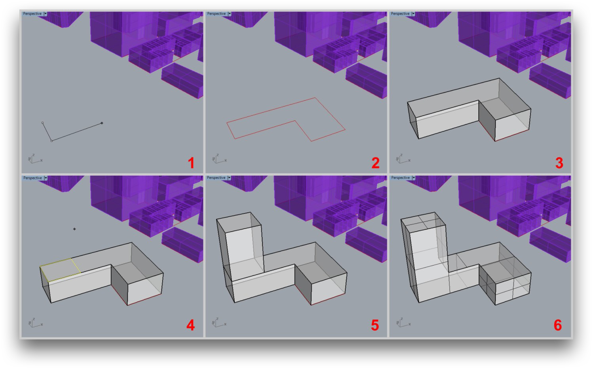
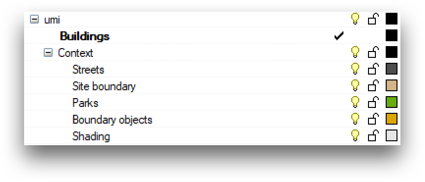
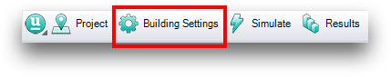
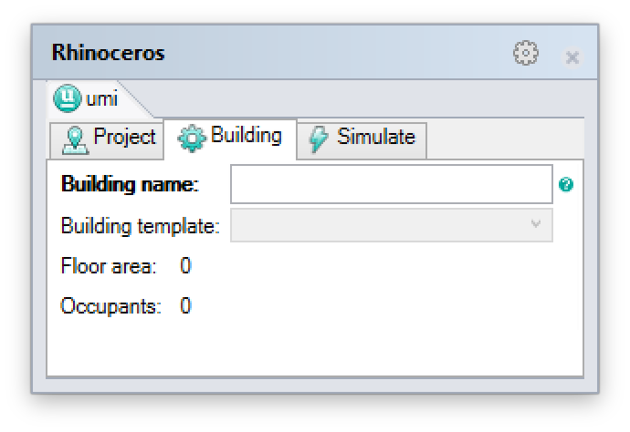
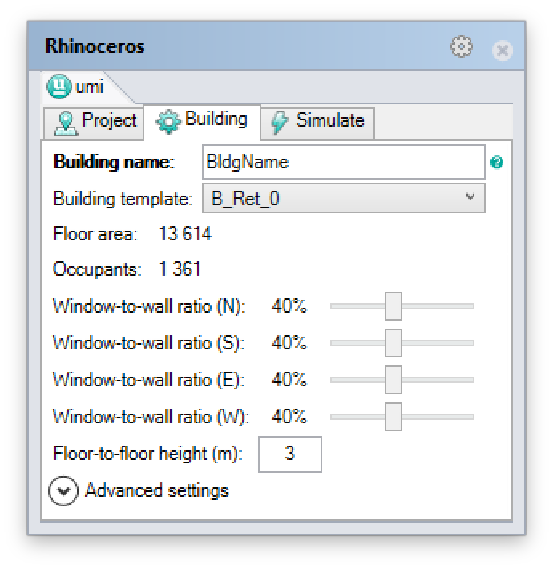

Model Setup - Buildings
=======================

Buildings are one of the key elements of an UMI project, used by most modules. In UMI, buildings are represented as building massings, i.e. 
outer envelopes including facades, roofs and external floors. In Rhino, a building is represented by a single volume modeled as a 
“boundary representation” or “brep”. A brep in Rhino can be generated by a variety of means, such as the extrusion of polylines and curves, 
or the repeated application of Boolean operations (such as union or intersection). If a building contains multiple occupied volumes, these 
should all be part of a single brep. However, additional exterior components (like shading devices) should not be modeled as part of the building
- these objects should be placed on separate `context layers <model-setup-context.html>`__. For a brep to be an acceptable building massing, it has to fulfill the following conditions:

   - The brep needs to be "airtight".
   - The brep's surfaces must all be planar.

As long as the above conditions are fulfilled, the brep's facade surfaces can have any orientation. "North" is always the direction of the y-axis.

Step 1: Building the brep geometry
----------------------------------

One of your first tasks when starting a new umi model will probably be constructing its buildings. In this example, a nontrivial building with two volumes is generated by creating each volume independently and then “joining” them into a single brep.

   
   Steps to create a building volume

  

Step 2: Adding the building to the “Buildings” layer
----------------------------------------------------

When umi starts a new project for you, it creates an "umi" Rhino layer, with sublayers corresponding to various objects that umi uses. One of these sublayers is the "Buildings" layer, and this is the layer on which all building breps must be placed in order for umi to "see" them as building objects.

   Some of the layers created when an umi project is started

You can create any sublayer structure within the Buildings layer that you want - umi will "see" buildings on any sublayers that are visible when you run a simulation. This is an essential way to keep large projects organized.

When you assign building settings to an object (see next section), umi will automatically move it to the Buildings layer for you if you forgot, but it's best to do it yourself so you don't lose track of any buildings.

Step 3: Assigning a name and a template in the “Settings” panel
---------------------------------------------------------------

After creating a building’s geometry and adding it to the Buildings layer, its properties must be specified. This is done using the Building Settings Panel, which can be opened by clicking on the “Building Settings” button of the umi toolbar or through the command “UmiOpenBuildingSettings”.

The umi panel will open with the “Building” tab active.

The "Building name" field contains the user-specified name for the umi building. This is the same as the Rhino object name; changing one will change the other. Umi offers an "UmiMultiname" Rhino command that can be used to automatically assign numbered names to a collection of buildings all at once.

The “Building template” field allows you to select the simulation template to apply to this building. The options are drawn from the currently-loaded building template library, which can be modified in the "Project" tab of the umi panel. (See "Configuring site parameters" in the User Guide.)

You can assign a template to multiple buildings at once by simply selecting all of them before making your selection from the combobox.

Step 4: Assigning other simulation properties
---------------------------------------------

Once a template is assigned to a particular building, additional settings are configurable.

The building's window-to-wall ratio (WWR) represents the percentage of the building's façade area that is glazed. Umi allows the specification of a different WWR value for each façade orientation. (If your building is not perfectly compass-aligned, umi will use the closest compass direction for each façade surface.)

The building's floor-to-floor height is the height between each story's floor and the floor of the story above it (umi assumes uniform story height). If the building's height is not evenly divisible by the provided value, various simulation modules will perform differently; refer to the individual documentation for each simulation module to learn what will happen.

.. note::
   The advanced settings section includes a series of modeling parameters intended for advanced and experimental use of the energy module. Parameters are detailed in section :ref:`energy-module-advanced`. The default values for these fields are sufficient for general use.
