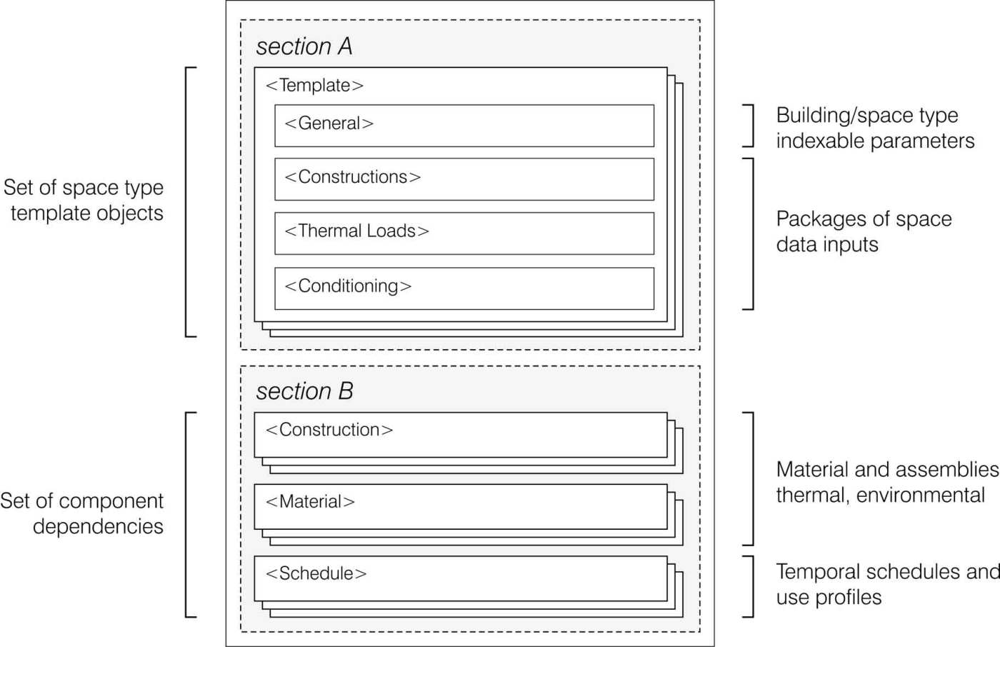
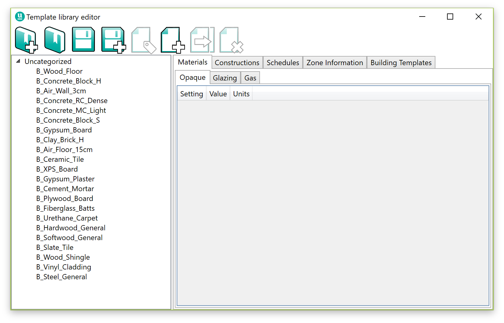
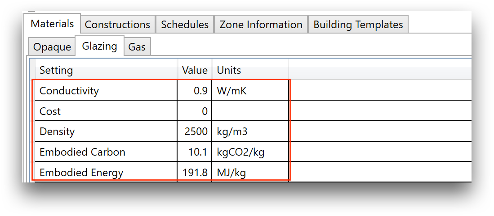

Model Setup - Template Editor
=============================

The Template Library Editor is an independent application provided with umi for the creation, management and edition of XML Template Library Files (TLF). TLF files are the open format used by umi to exchange and store information about materials, constructions, schedules, thermal loads, spaces and buildings. This section explains the basic characteristics of the TLF and the basic controls of the editor.

The XML Template Library File
-----------------------------

The Template Library File (TLF) is an XML type file with a specific structure in which all building and space properties, both thermal and environmental, are stored for multiple building types. It includes both a library of building definitions, and libraries of all their data dependencies.

Within the file, these categories are listed as XML objects, grouped by the previously named types, and can be created and edited both through the use of the template editor, and directly in any text edition software (See Figure below for a diagram of the data structure). To know more about the TLF file format and its importance in building performance simulation in design you can access the academic paper “\ *Towards standardized building properties template files for early design energy model generation*\ ”, accessible in the following `link <http://web.mit.edu/sustainabledesignlab/publications/TemplateEditor_SimBuild2014.pdf>`__.

   The template library file structure

Opening a TLF file and navigating contents
------------------------------------------

You can open the :index:`Template Library Editor`, from the “Project” umi panel by clicking the “Edit” button. The application will pop up in a separate window, and immediately open the TLF file currently loaded in your umi file. If you did not change the original file, you will see the default library file opened.

   Template Editor Main Window

Additional file management commands are accessible from the “File” menu at the top left. You can open a different TLF by clicking “Open”, and finding the file in the browser window. You can as well save the file with a different name through “Save as”. Finally you can “Save” the file under its current name. Note that all changes you make on the library will be lost if you do not save the file before closing the editor. If the file you modify is the same one you have loaded in umi, changes will be immediately applied to your file, but if you rename the file remember to load it in umi.

Adding and modifying components in a TLF file
---------------------------------------------

.. todo:: this section needs to be drafted

Basic content modification
--------------------------

Each component data type in a library file has different data fields accessible within the Template Editor, used in different modules of umi. This section provides general directions about how to manipulate these fields. However, in order to know more about the specific meaning and interpretation of the fields, you can visit the “Embodied Energy” and “Operational Energy” sections of this user guide.

   You can add a new component to the table by clicking the “Add Component” button
