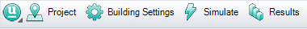
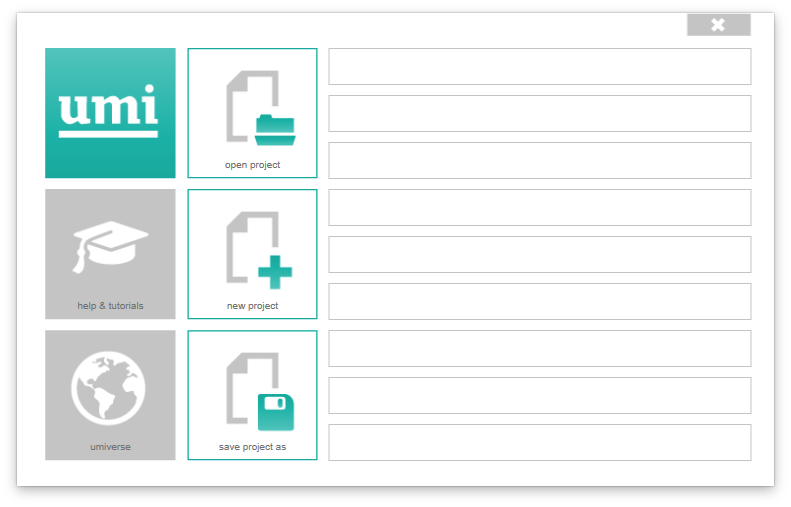

# Starting a new umi project

To start a new umi project, click the "umi" button in the umi toolbar:

You'll see the following splash screen:

Click the "Start New Project" button to get started. If you've got existing geometry you want to use, have it open before starting your project, or start from a blank document to create a new project from scratch. You'll be asked where to save your umi "bundle", or project file.

Put it wherever you like. From now on, this file will contain everything needed to use your umi project, and any original geometry you started from will remain untouched. You can also open an existing umi project from the Example Projects page.
