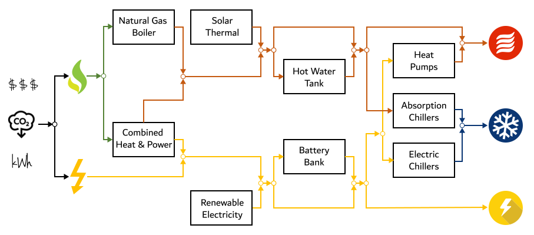

.. _district-energy:

Modeling Low Carbon Energy Systems
==================================

.. admonition:: Authorship

   The district energy plugin enables the simulation of city-scale energy demand at the plant level. It is developed by `Samuel Letellier-Duchesne <https://www.researchgate.net/profile/Samuel_Letellier-Duchesne>`_ (Polytechnique Montréal) and `Shreshth Nagpal <https://www.researchgate.net/profile/Shreshth_Nagpal>`_ (MIT). The following sections present an overview of the modelling assumptions and mathematical description of each energy sub-module.

The Big Picture
---------------

A district level thermal energy plant comprises several equipment that serve the distribution network for a project’s hot water, chilled water and electricity requirements by converting grid purchased utilities into usable thermal and electrical energy. The plant inputs, usually a combination of grid electricity and natural gas, can vary considerably based on the selection, capacity and efficiency of various plant equipment. The thermal plant should be configured carefully after considering the load balance between project electricity and thermal energy requirements, and the relative emissions and costs associated with grid electricity and natural gas.

The model is defined as a cascade of different components (energy modules) that try to meet the demand (either hot water, chilled water or electricity) for all 8760 hours of the year. A module will supply energy up to its given capacity. If the demand is higher than a module's capacity, the remaining demand will be met by the subsequent modules in the chain. The chain of energy supplies is defined here and illustrated in :numref:`figure_modele_overview`.



   Schematic arrangement of various thermal plant equipment that are incorporated in this tool

The input to the tool includes hourly load profiles for hot water, chilled water, and electricity, as simulated by the Operational Energy Module and, in a future version of this plugin, the dynamic distribution network module. As each equipment is individually enabled or disabled by the user, and its performance characteristics are modified, the thermal plant planning tool calculates the hourly consumption of purchased grid electricity and natural gas.

Input Profiles
--------------

+-----------------------------------------------+----------------------+
| Model component / Input parameter             | Default Value        |
+===============================================+======================+
| Hourly chilled water load profile (kWh)       | From distribution    |
+-----------------------------------------------+ network              |
| Hourly hot water load profile (kWh)           |                      |
+-----------------------------------------------+                      |
| Hourly electricity load profile (kWh)         |                      |
+-----------------------------------------------+----------------------+
| Hourly location solar radiation data (kWh/m2) | From selected        |
+-----------------------------------------------+ weather file         |
| Hourly location wind speed data (m/s)         |                      |
+-----------------------------------------------+----------------------+

.. Note::

   In this version of the plugin, the model assumes there is no heat loss due to the distribution network.


Energy Supply Modules
---------------------

The following section presents a mathematical description of each energy modules.

Absorption chillers
```````````````````

The model assumes that the absorption chillers meet the base load. It is the first module that will be used to meet the demand up to the chillers capacity. The annual hot water required to generate project chilled water, :math:`hw_{abs}`, is added to the projects hot water demand and can be expressed as:

.. math::
   :label: hwabs

   hw_{abs}=\sum_{n=1}^{8760}\left [ \frac{\min \left ( chw_n, cap_{abs} \right )}{ccop_{abs}} \right ]

| where:
|
| :math:`chw_n` is the chilled water load from the distribution network at a particular timestep
| :math:`cap_{abs}` is the cooling capacity of absorption chillers
| :math:`ccop_{abs}` is the Cooling Coefficient Of Performance
|

The chilled water demand met by the absorption chiller, :math:`chw_{abs}`, is given by:

.. math::
   :label: chwabs

   chw_{abs}= \min \left ( chw_n, cap_{abs} \right )

Input Parameters
''''''''''''''''

+----------------------------------------------+------------------------------------------------------------------------------------+---------------+
| Model component / Input parameter            | Description                                                                        | Default Value |
+==============================================+====================================================================================+===============+
| Capacity as percent of peak cooling load (%) | Ratio of cooling delivered by absorption chillers to total load at peak conditions | 0             |
+----------------------------------------------+------------------------------------------------------------------------------------+---------------+
| Cooling coefficient of performance           | Average annual ratio of useful cooling delivered to natural gas consumed           | 0.90          |
+----------------------------------------------+------------------------------------------------------------------------------------+---------------+

Typical Values
''''''''''''''

Table :numref:`typicalAbs` summarizes typical chiller efficiency ranges for different chiller technologies.

.. table:: Typical chiller efficiency ranges with different prime drivers
   :name: typicalAbs

   +----------------------------------------------------------------+--------------------+----------------+
   | Chiller type                                                   | Typical efficiency | Capacity (KW)  |
   +================================================================+====================+================+
   | Steam driven centrifugal HW absorption chiller (single effect) | COP 0.55–0.70      | <200 to >11500 |
   +----------------------------------------------------------------+--------------------+----------------+
   | Steam absorption chiller (single effect)                       | COP 0.60–0.8       | <200 to >11500 |
   +----------------------------------------------------------------+--------------------+----------------+
   | Direct fired (double effect) absorption chiller                | COP 0.85–1.30      | <350 to >11500 |
   +----------------------------------------------------------------+--------------------+----------------+

Electric chillers
`````````````````

If the absorption chillers can't supply all the chilled water demand, then the electric chillers will cover the remaining. This module has a infinite capacity.
It's electricity demand [kWh] is defined as:

.. math::
   :label: elecech

   elec_{ech} =
   \begin{cases}
   \sum_{n=1}^{8760}\frac{chw_n-cap_{abs}}{ccop_{ech}}, & \text{if } chw_n > cap_{abs}\\
   0,                                      & \text{otherwise}
   \end{cases}

and the chilled water produced [kWh] is defined as:

.. math::
   :label: chwech

   chw_{ech} =
   \begin{cases}
   \sum_{n=1}^{8760}chw_n-cap_{abs}, & \text{if } chw_n > cap_{abs}\\
   0,                                      & \text{otherwise}
   \end{cases}

Input Parameters
''''''''''''''''

+------------------------------------+--------------------------------------------------------------------------+---------------+
| Model component / Input parameter  | Description                                                              | Default Value |
+====================================+==========================================================================+===============+
| Cooling coefficient of performance | Average annual ratio of useful cooling delivered to electricity consumed | 4.40          |
+------------------------------------+--------------------------------------------------------------------------+---------------+

Typical Values
''''''''''''''

Table :numref:`typicalEch` summarizes typical chiller efficiency ranges for different chiller technologies.

.. table:: Typical chiller efficiency ranges with different prime drivers [#]_
   :name: typicalEch

   +---------------------------------------------------------------------+--------------------+-----------------+
   | Chiller type                                                        | Typical efficiency | Capacity (KW)   |
   +=====================================================================+====================+=================+
   | Electric centrifugal (standard single compressor)                   | COP 4.7–6.75       | 1750 to > 5275  |
   +---------------------------------------------------------------------+--------------------+-----------------+
   | Electric centrifugal (standard dual compressor)                     | COP 4.7–6.75       | 5275 to >14000  |
   +---------------------------------------------------------------------+--------------------+-----------------+
   | Electric centrifugal (single compressor industrial – field erected) | COP 4.7–6.75       | 8800 to > 20000 |
   +---------------------------------------------------------------------+--------------------+-----------------+

Solar thermal collectors
````````````````````````

Similarly to chilled water, the hourly hot water load profile (:math:`hw_n`), is an input to the model from the distribution network. This module calculates hot water generation potential per unit collector area based on user defined values of collector efficiency (:math:`eff_{shw}`), an area utilization factor to account for collector frames and other infrastructural requirements (:math:`util_{shw}`), and miscellaneous losses (:math:`loss_{shw}`). In addition to these performance parameters, users input an offset target as a percentage of total annual hot water demand (:math:`off_{shw}`). In combination with the hourly solar radiation data available from the weather file (:math:`rad_n`), the model calculates the overall area needed for solar collectors (:math:`area_{shw}`), and the annual total solar hot water generation to meet building loads (:math:`hw_{shw}`), which can be expressed as:

.. math::
   :label: areashw

   area_{shw} = \sum_{n=1}^{8760}\frac{hw_n*off_{shw}}{rad_n eff_{shw} \left(1 - loss_{shw} \right ) util_{shw}}

| where:
|
| :math:`hw_n` is the hot water load profile at a particular timestep
| :math:`off_{shw}` is the user-defined amount of energy the module should produce (or offset)
| :math:`rad_n` is the solar energy falling on a horizontal surface during the timestep
| :math:`eff_{shw}` is the collector efficiency
| :math:`loss_{shw}` is the collector
| :math:`util_{shw}` is the area utilization factor
|

.. math::
   :label: hwshw

   hw_{shw} = \sum_{n=1}^{8760}\min \left ( rad_n area_{shw} eff_{shw} util_{shw} \left( 1 - loss_{shw} \right), hw_n + hw_{abs} \right )

.. note::

   This module cannot model the solar radiation on an inclined surface. It will therefore assume solar collectors are laid horizontally. This simplification is fine considering the level of detail of an early design analysis.

+-----------------------------------------------+---------------------------------------------------------------------------------------------+---------------+
| Model component / Input parameter             | Description                                                                                 | Default Value |
+===============================================+=============================================================================================+===============+
| Target offset as percent of annual energy (%) | Ratio of heating delivered by solar collectors to total annual heating requirement          | 0             |
+-----------------------------------------------+---------------------------------------------------------------------------------------------+---------------+
| Collector efficiency (%)                      | Average annual ratio of the heat output from collectors divided by received solar radiation | 45            |
+-----------------------------------------------+---------------------------------------------------------------------------------------------+---------------+
| Area utilization factor (%)                   | Accounts for collector frames and other infrastructural requirements                        | 75            |
+-----------------------------------------------+---------------------------------------------------------------------------------------------+---------------+
| Miscellaneous losses (%)                      | Accounts for other losses including leakage, distribution, or context shading               | 15            |
+-----------------------------------------------+---------------------------------------------------------------------------------------------+---------------+

Hot Water Storage Tanks
```````````````````````

Any solar generation that is surplus to the project loads for each hour is assumed to charge a hot water tank. Based on a user defined tank capacity (:math:`cap_{hwt}`), the previous hour’s charge (:math:`chg_{n-1}`) and current balance (surplus - deficits), the model calculates the tank charge for each hour (:math:`chg_n`). First, the solar hot water balance is defined as:

.. math::
   :label: shwbalance

   bal_{shw} = rad_n area_{shw} eff_{shw} util_{shw} \left( 1 - loss_{shw} \right) - hw_n - hw_{abs}

It represents the energy that goes into or comes out of the storage system. If :math:`bal_{shw}` is negative, it means that we are discharging the tank during this timestep. If it is positive, then we are charging the tank. Tank charging and discharging is limited by the charging and discharging rates, which are calculated based on the size of the storage.

.. note:: Charging and Discharging Rates

   The module assumes the storage system can be fully charged during :math:`n` days of autonomy, assuming only 12 hours per day can supply solar energy to the tank. For example, if a storage tank has an autonomy of 3 days, it's charging rate will be :math:`rate = \frac{cap_{hwt}}{nb_{days} * \text{12 hours/day}} \text{[kWh/h]}`, where :math:`cap_{hwt}` is the capacity of the tank [kWh] and :math:`nb_{days}` is the number of days of autonomy specified by the user.


Input Parameters
''''''''''''''''

+--------------------------------------------+-----------------------------------------------------------------------------+--------------+
| Model component / Input parameter          | Description                                                                 | Default      |
|                                            |                                                                             | Value        |
+============================================+=============================================================================+==============+
| Capacity as the number of days of autonomy | Number of average annual days that tanks can meet demand once fully charged | 0            |
| (#)                                        |                                                                             |              |
+--------------------------------------------+-----------------------------------------------------------------------------+--------------+
| Miscellaneous losses (%)                   | Accounts for other losses including leakage and distribution                | 15           |
+--------------------------------------------+-----------------------------------------------------------------------------+--------------+


Electric Heat Pumps
```````````````````

The model assumes that these loads are first met by renewables along with thermal storage, and only demand in surplus of their user defined capacity is sent over to the remaining equipment. The electricity consumption (:math:`elec_{ehp}`), required to generate hot water from heat pumps is based on their capacity (:math:`cap_{ehp}`), and heating coefficient of performance (:math:`hcop_{ehp}`), and can be expressed as:

.. math::
   :label:

   elec_{ehp} = \sum_{n=1}^{8760}\frac{\min \left ( hw_n, cap_{ehp} \right )}{hcop_{ehp}}

The hot water produced is then defined as:

.. math::
   :label: hwehp

   hw_{ehp} = \text{SmallestNonNegative} \left ( hw_n + hw_{abs} - hw_{shw} - hw_{hwt} - hw{chp}, cap_{ehp}  \right )

| where:
|
| :math:`hw_n` is the hot water load profile at a particular timestep
| :math:`hw_{abs}` is the additional load from the `Absorption chillers`_
| :math:`hw_{shw}` is the load covered by the `Solar thermal collectors`_ array
| :math:`hw_{hwt}` is the load covered by the `Hot Water Storage Tanks`_
| :math:`hw_{chp}` is the load covered by the `Combined Heat & Power`_ plant
|

Input Parameters
''''''''''''''''

+----------------------------------------------+---------------------------------------------------------------------------+---------------+
| Model component / Input parameter            | Description                                                               | Default Value |
+==============================================+===========================================================================+===============+
| Capacity as percent of peak heating load (%) | Ratio of heating delivered by heat pumps to total load at peak conditions | 0             |
+----------------------------------------------+---------------------------------------------------------------------------+---------------+
| Heating coefficient of performance           | Average annual ratio of useful heating delivered to electricity consumed  | 3.20          |
+----------------------------------------------+---------------------------------------------------------------------------+---------------+


Natural gas boilers
```````````````````

The Natural Gas Boilers acts as the last module that can produce hot water. Its priority is lower than the `Combined Heat & Power`_ plant, which means that the hot water produced by the boilers supplements any remaining energy that could not be produced by the `Solar thermal collectors`_, the `Hot Water Storage Tanks`_ or the `Combined Heat & Power`_ plant.

With a user defined heating efficiency (:math:`eff_{ngb}`), the hot water produced by the Natural Gas Boilers (:math:`hw_{ngb}`) is defined as:

.. math::
   :label: hwngb

   hw_{ngb} = \max \left (hw_n - hw{ehp} + hw{abs} - hw{shw} - hw_{hwt} - hw_{chp}, 0 \right);


The natural gas consumption of the boilers is then defined as:

.. math::
   :label: ngngb

   ngas_{ngb} = \max \left (hw_n + hw_{abs} - hw_{ehp} - hw_{shw} - hw_{hwt} - hw_{chp}, 0 \right )

| Where:
|
| :math:`hw_n` is the hot water load profile at a particular timestep
| :math:`hw_{abs}` is the additional load from the `Absorption chillers`_
| :math:`hw_{hwp}` is the load covered by the `Electric heat pumps`_
| :math:`hw_{shw}` is the load covered by the `Solar thermal collectors`_ array
| :math:`hw_{hwt}` is the load covered by the `Hot Water Storage Tanks`_
| :math:`hw_{chp}` is the load covered by the `Combined Heat & Power`_ plant
|

Input Parameters
''''''''''''''''

+-----------------------------------+-------------------------------------------------------------------+---------------+
| Model component / Input parameter | Description                                                       | Default Value |
+===================================+===================================================================+===============+
| Heating efficiency (%)            | Average annual ratio of useful heating delivered to fuel consumed | 70            |
+-----------------------------------+-------------------------------------------------------------------+---------------+


Photovoltaic Array
``````````````````

The photovoltaic calculation is based on user defined values for panel efficiency (:math:`eff_{pv}`), an area utilization factor to account for panel frames and other infrastructural requirements (:math:`util_{pv}`), and miscellaneous losses (:math:`loss_{pv}`). In addition to these performance parameters, users input an offset target as a percentage of total electricity demand. In combination with the hourly solar radiation data available from the weather file (:math:`rad_n`), The model calculates the overall area needed for the photovoltaic array (:math:`area_pv`), and the total electricity generation (:math:`elec_pv`), which can be expressed as:

.. math::

   elec_{pv} = \sum_{n=0}^{8760} rad_n area_{pv} eff_{pv}  util_{pv} (1-loss_{pv})

.. note::

   This module cannot model the solar radiation on an incline surface. It will therefore assume solar collectors are laid horizontally.

+-----------------------------------------------+-------------------------------------------------------------------------------------------+---------------+
| Model component / Input parameter             | Description                                                                               | Default Value |
+===============================================+===========================================================================================+===============+
| Target offset as percent of annual energy (%) | Ratio of electricity delivered by PV Array to total annual electricity requirement        | 0             |
+-----------------------------------------------+-------------------------------------------------------------------------------------------+---------------+
| Cell efficiency (%)                           | Average annual ratio of electricity output from array divided by received solar radiation | 15            |
+-----------------------------------------------+-------------------------------------------------------------------------------------------+---------------+
| Area utilization factor (%)                   | Accounts for module frames and other infrastructural requirements                         | 75            |
+-----------------------------------------------+-------------------------------------------------------------------------------------------+---------------+
| Miscellaneous losses (%)                      | Accounts for other losses including line losses and balance of system                     | 15            |
+-----------------------------------------------+-------------------------------------------------------------------------------------------+---------------+


Wind Turbines
`````````````

The wind turbine calculation is based on user defined values for turbine coefficient of performance (:math:`C_p`), the rotor area per turbine (:math:`A`), and miscellaneous losses (:math:`loss_{wnd}`). In addition to these performance parameters, users input an offset target as a percentage of total electricity demand (:math:`off_{wnd}`). In combination with the hourly wind velocity data available from the weather file (:math:`V`), the model calculates the number of turbines needed and the annual electricity generation based on equation :eq:`nbwind` and equation :eq:`elecwind`.

.. math::
   :label: nbwind

   num_{wnd} = \frac{\sum_{n=1}^{8760}elec_n off_{wnd}}{\sum_{n=1}^{8760}pow_{n}\left ( 1 - loss_{wnd} \right )}

| Where:
|
| :math:`elec_n` is the electricity demand at timestep :math:`n`.
| :math:`off_{wnd}` is the target offset as percent of annual energy.
| :math:`pow_{n}` is the power output in kilowatts for one turbine (calculated from equation :eq:`wind`)
| :math:`loss_{wnd}` is the miscellaneous losses.
|

.. math::
   :label: elecwind

   elec_{wnd} = power \left ( 1 - loss_{wnd} \right ) num_{wnd}

| Where:
|
| :math:`elec_n` is the electricity demand at timestep :math:`n`.
| :math:`off_{wnd}` is the target offset as percent of annual energy.
|

.. math::
   :label: wind

   pow_n =
   \begin{cases}
   \frac{C_p \rho A  V_n^3}{2 \cdot 1000}, & \text{if } cut_{in} < V_n< cut_{out}\\
   0,                                      & \text{otherwise}
   \end{cases}

| Where:
|
| :math:`pow_n` is the turbine's power output [kW] at a particular timestep.
| :math:`C_p` is the maximum power coefficient, ranging from 0.25 to 0.45. It is dimensionless (theoretical maximum = 0.59).
| :math:`\rho` is the air density [kg/m\ :sup:`3`]. Taken constant as 1.2753.
| :math:`A` is the rotor swept area [m\ :sup:`2`].
| :math:`V_n` is the Wind Speed [m/s] at a particular timestep.
|

Equation :eq:`wind` is taken from `windpowerengineering.com <https://www.windpowerengineering.com/construction/calculate-wind-power-output/>`_.

Input Parameters
''''''''''''''''

+-----------------------------------------------+-----------------------------------------------------------------------------------------+---------------+
| Model component / Input parameter             | Description                                                                             | Default Value |
+===============================================+=========================================================================================+===============+
| Target offset as percent of annual energy (%) | Ratio of electricity delivered by wind turbines to total annual electricity requirement | 0             |
+-----------------------------------------------+-----------------------------------------------------------------------------------------+---------------+
| Turbine coefficient of performance            | Average annual ratio of power captured by turbine to total power available in the wind  | 0.3           |
+-----------------------------------------------+-----------------------------------------------------------------------------------------+---------------+
| Cut-in speed (m/s)                            | Minimum wind speed at which the turbine blades overcome friction and begin to rotate    | 5             |
+-----------------------------------------------+-----------------------------------------------------------------------------------------+---------------+
| Cut-out speed (m/s)                           | Speed at which the turbine blades are brought to rest to avoid damage from high winds   | 25            |
+-----------------------------------------------+-----------------------------------------------------------------------------------------+---------------+
| Rotor area per turbine (m2)                   | The swept area is the plane of wind intersected by the turbine                          | 15            |
+-----------------------------------------------+-----------------------------------------------------------------------------------------+---------------+
| Miscellaneous losses (%)                      | Accounts for other losses                                                               | 15            |
+-----------------------------------------------+-----------------------------------------------------------------------------------------+---------------+

Battery Bank
````````````

Any renewable energy generation that is surplus of the project loads for each hour is assumed to charge a Battery Bank. Based on a user defined battery capacity (:math:`cap_{bat}`), the previous hour’s charge (:math:`chg_{n-1}`) and current balance (surplus - deficits), the model calculates the battery charge for each hour (:math:`chg_n`). Similarly to the Hot water tank, charging and discharging of the battery is limited by its charging and discharging rates. The rates are assumed to follow the same principles as the hot water tank charging and discharging rates.

The electricity balance is defined as the balance of generated electricity and electricity consumption at a particular timestep :

.. math::
   :label: elecbalance

   bal_{elec} = elec_{pv} + elec_{wnd} - elec_n - elec_{ech} - elec_{ehp}

It represents the energy that goes into or comes out of the storage system. If :math:`bal_{bal}` is negative, it means that we are discharging the battery during this timestep. If it is positive, then we are charging the battery. Furthermore, the battery sees a certain loss (:math:`loss_{bat}`) whenever charging and discharging occurs and thus the battery charge is defined as:

.. math::
   :label: batchg

   bat_{chg,n} =
   \begin{cases}
   \max \left[ bat_{chg,n-1} + bal_{elec} \left(1-loss_{bat} \right), \\
   \max \left( bat_{chg,n-1} - dchg_{bat}, 0 \right) \right ], & \text{if } bal_{elec} < 0\\
   \text{SmallestNonNegative} \left [ bat_{chg,n-1} + bal_{elec} \left(1-loss_{bat} \right) , \\
   \text{SmallestNonNegative} \left( bat_{chg,n-1} + chrg_{bat}, cap_{bat} \right) \right], & \text{if } bal_{elec} \geq 0\\
   \end{cases}


+--------------------------------------------+---------------------------------------------------------------------------------+---------------+
| Model component / Input parameter          | Description                                                                     | Default Value |
+============================================+=================================================================================+===============+
| Capacity as number of days of autonomy (#) | Number of average annual days that batteries can meet demand once fully charged | 0             |
+--------------------------------------------+---------------------------------------------------------------------------------+---------------+
| Miscellaneous losses (%)                   | Accounts for other losses including line losses and balance of system           | 15            |
+--------------------------------------------+---------------------------------------------------------------------------------+---------------+

Combined Heat \& Power
``````````````````````

By default, the combined heat and power component tracks and serves the remaining project hot water demand up to its maximum heating capacity. The heating capacity is calculated by the model based on user defined electrical capacity (:math:`cap_{chp}`),  electricity generation efficiency (:math:`eff_{chp}`), and heat recovery effectiveness (:math:`hrec_{chp}`). The annual heating energy recovered from the combined heat and power plant and supplied to the project (:math:`hw_{chp}`), can be expressed as:

.. math::
   :label: hwchp

   hw_{chp} =
   \begin{cases}
   \min \left [ \frac{cap_{chp}}{eff_{chp}} hrec_{chp}, hw_n + hw_{abs} - hw_{shw} - hw_{hwt} - hw_{ehp} \right] & \text{for thermal tracking}\\
   ngas_{chp} hrec_{chp} & \text{for electrical tracking}\\
   \end{cases}

The module can also be assigned to track electricity instead of the thermal load. In this case, the combined heat and power component tracks and serves the project electrical load up to its capacity that remains after subtracting the renewable system (:math:`elec_{ren}`) and battery bank (:math:`elec_{bat}`) supply from overall demand (:math:`elec_n`).

+-----------------------------------------------+---------------------------------------------------------------------------------+---------------+
| Model component / Input parameter             | Description                                                                     | Default Value |
+===============================================+=================================================================================+===============+
| Tracking mode                                 | Control the generator to prioritize meeting the hot water or electricity demand | Thermal       |
+-----------------------------------------------+---------------------------------------------------------------------------------+---------------+
| Capacity as percent of peak electric load (%) | Ratio of electricity delivered by generator to total demand at peak conditions  | 0             |
+-----------------------------------------------+---------------------------------------------------------------------------------+---------------+
| Electrical efficiency (%)                     | Average annual ratio of electricity delivered by generator to fuel consumed     | 22            |
+-----------------------------------------------+---------------------------------------------------------------------------------+---------------+
| Waste heat recovery effectiveness (%)         | Average annual ratio of usable heat recovered from generator to fuel consumed   | 29            |
+-----------------------------------------------+---------------------------------------------------------------------------------+---------------+

References
----------

.. [#] S. Tredinnick and G. Phetteplace, 8 - District cooling, current status and future trends, In Woodhead Publishing Series in Energy, edited by Robin Wiltshire,, Woodhead Publishing, Oxford, 2016, Pages 167-188, Advanced District Heating and Cooling (DHC) Systems, ISBN 9781782423744, `<https://doi.org/10.1016/B978-1-78242-374-4.00008-2>`_. (`<https://www.sciencedirect.com/science/article/pii/B9781782423744000082>`_)
