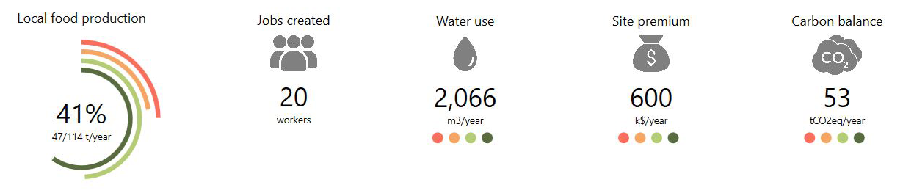
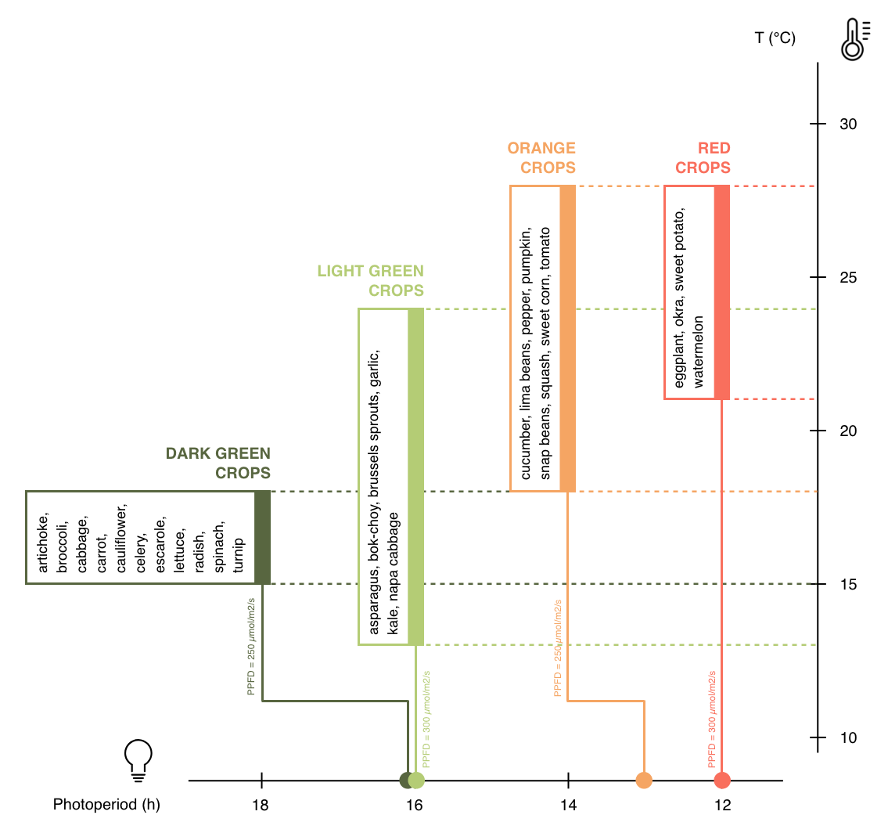
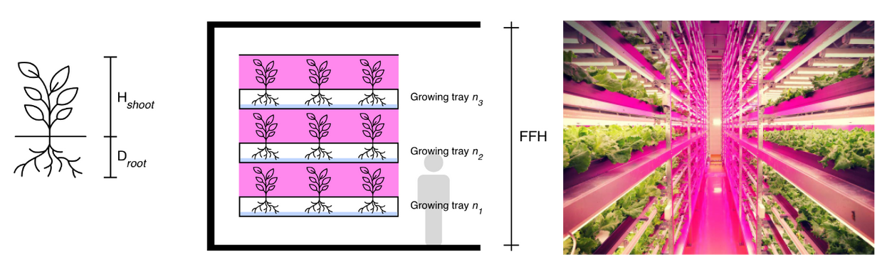
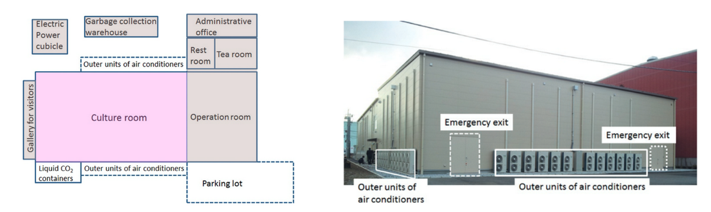
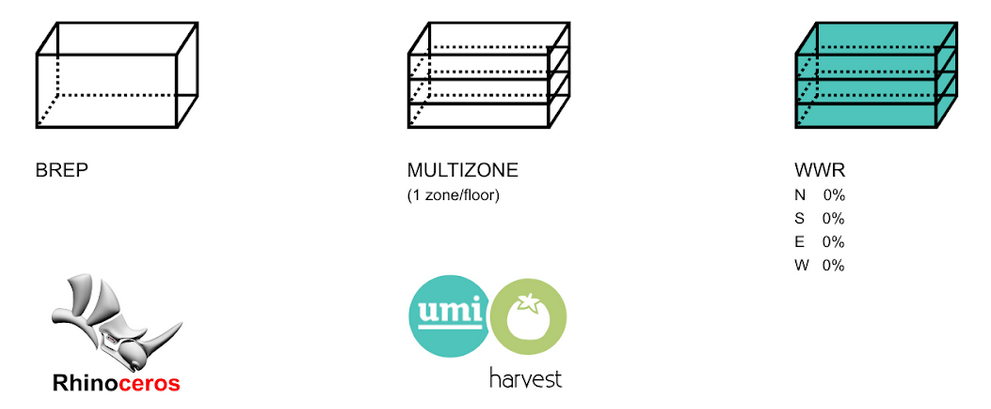

.. 00-HARVEST_Documentation documentation master file, created by
   sphinx-quickstart on Mon Jun  3 12:53:42 2019.
   You can adapt this file completely to your liking, but it should at least
   contain the root `toctree` directive.

HARVEST
=======

.. admonition:: Authorship

   HARVEST – the urban food production simulation plugin – estimates food yields of indoor farms and their associated operational building energy use, water use and carbon emissions, as well as their economic performance through metrics such as operational costs and job creation. It is developed by `Khadija Benis <https://www.researchgate.net/profile/Khadija_Benis2>`_ (MIT). The following sections present an overview of the inputs, structure and outputs of the module.

Background
----------

Controlled-Environment Agriculture
,,,,,,,,,,,,,,,,,,,,,,,,,,,,,,,,,,

Controlled-Environment Agriculture (CEA) is an umbrella term for a large set of cultivation systems where the environment is controlled in order to extend crop growth period. Whereas the scope of the designation is broad enough to include very low-tech systems such as cloches set on field-grown crops, this first version of HARVEST only considers indoor conditioned farms – also called `Plant Factories <https://www.sciencedirect.com/book/9780128017753/plant-factory>`_ – using soilless cultivation techniques and artificial lighting. These indoor farms include container farms, an emerging trend that consists of growing crops in retrofitted shipping containers equipped with hydroponic systems. Controllable environment variables in CEA include CO2, humidity, light, nutrients, pests, temperature, ventilation and water.

HARVEST estimates food yields of indoor farms and their associated operational building energy use, as well as water use and carbon emissions. It also provide insights on the economic performance of the farms through metrics such as operational costs and jobs created locally. Additionally, it compares simulation outputs to existing urban supply chains and provides a carbon balance as well as a site premium. The following sections describe the simulation inputs, the structure of the tool and its underlying models,  and the simulation outputs.

Fig. 1: Key performance metrics provided by HARVEST

Modelling crop growth
,,,,,,,,,,,,,,,,,,,,,

Photosynthesis is fundamental to plant growth and has been shown to be affected by environmental factors such as light and temperature (Kozai et al., 2016). Crop growth models consist of mathematical equations that represent these reactions occurring between plants and their environment, predicting the growth rate and final state of total biomass and harvestable yield (Jame and Cutforth, 1996). HARVEST food production calculations use the gathered data on optimal growth conditions of crops and apply these models as described in the sections below.

Thermo-classification of vegetables was one of the earliest attempts to group plants and remains widely used today (Welbaum, 2015). Based on their light and temperature requirements for optimal growth, HARVEST clusters crops into four groups – red, orange, light green, and dark green crops (see Fig. 2). Red and orange are warm season crops. Red crops prefer temperatures above 21 oC, whereas orange crops are adapted to temperatures ranging from 18.3 to 29.4 oC. Light green and dark green are cool-season crops. Light green crops are adapted to temperatures ranging from 12.8 to 23.9 oC, whereas dark green crops prefer average monthly temperatures of 15.6 to 18.3 oC.

Fig. 2: Classification of crops based on light and temperature requirements

Simulation inputs
-----------------

CEA Farm templates
,,,,,,,,,,,,,,,,,,

Simulating indoor crop growth requires the definition of specific templates for the “farm” building type, which are based on the optimal indoor conditions required by the plants. A default crop template library is embedded in HARVEST. In order to build these templates, a database of optimal growth conditions for a set of crops was developed through a literature review of scientific articles describing the settings and outcomes of controlled-environment cultivation experiments conducted in growth chambers equipped with hydroponic systems. The UMI Template Editor can be used to edit and/or add templates.

Zone information
;;;;;;;;;;;;;;;;

The building envelope can be customized by the user according to the specific needs of a given project, as indoor farms can be implemented in any building. For instance, to model a shipping container growing unit, the user can set the envelope and adjust its dimensions according to the envelope properties and dimensions of standard shipping containers.

Occupancy, equipment and lighting loads are defined according to farms’ operation requirements. For occupancy, a density of farmers (ppl/m2) and a farm occupancy schedule were set, documented by existing practices in commercial hydroponic farms. Similarly, based on equipment specificities and schedules of hydroponic farms, equipment power density (W/m2) and equipment schedule were set. Light power density (W/m2) is defined according to the specificities of the lighting fixtures and to the number of vertically stacked growing racks for a given crop. A lighting schedule is allocated based on the photoperiod requirements of the crop, and an illuminance target (lux) is set according to the PPFD. Finally, heating and cooling set points are defined according to the thermal requirements of each crop, documented in the literature.

+--------------------------+---------------------------------------------------------------------------+
| Zone information         | Settings                                                                  |
+==========================+===========================================================================+
| Constructions            | Customized by the user                                                    |
+--------------------------+---------------------------------------------------------------------------+
| Loads                    | From crop requirements                                                    |
+--------------------------+---------------------------------------------------------------------------+
| Ventilation              | From crop requirements                                                    |
+--------------------------+--------------------+------------------------------------------------------+
| Domestic hot water       | From crop requirements                                                    |
+--------------------------+---------------------------------------------------------------------------+
| Windows                  | All WWR automatically set to 0% when selecting the CEA Farm Simulator     |
+--------------------------+--------------------+------------------------------------------------------+

Schedules
;;;;;;;;;

Depending on the distribution of labor that is assumed for the farms, daily occupancy can be allocated in different ways. As for lighting, testing different schedules can have great impacts on simulation results. In fact, under a given optimal temperature range, plant growth is further affected by light intensity and it has been established that under a controlled environment, the response of crop growth to increase in PPFD is virtually linear (e.g., Cockshull et al., 1992). This linear response of plant growth over target daily Photosynthetically Active Radiation PAR24 – also called Daily Light Integral (DLI) – and the reciprocity between the effects of PPFD and photoperiod at the same DLI can be used in lighting design when choosing the fixtures’ PPFD and deciding photoperiod needed to achieve target DLI (Kozai et al., 2016). For instance, the target DLI of 11 mol/m2/day that is required for strawberry can either be achieved by 255 μmol/m2/s through a photoperiod of 12 hours or by 170 μmol/m2/s through a photoperiod of 18 hours. The reduction of PPFD reduces the number of lighting fixtures and thereby capital costs, while reducing and changing photoperiod distribution can take advantage of the off-peak hours of utility charges and contribute to a better energy demand management.

+--------------------------+---------------------------------------------------------------------------+
| Schedules                | Settings                                                                  |
+==========================+===========================================================================+
| Occupancy                | Farmers occupancy                                                         |
+--------------------------+---------------------------------------------------------------------------+
| Equipment                | Farm equipment                                                            |
+--------------------------+---------------------------------------------------------------------------+
| Lighting                 | From crop optimal photoperiod                                             |
+--------------------------+--------------------+------------------------------------------------------+
| Heating                  | From crop optimal temperature range                                       |
+--------------------------+---------------------------------------------------------------------------+
| Cooling                  | From crop optimal temperature range                                       |
+--------------------------+--------------------+------------------------------------------------------+
| Domestic hot water       | Farm hot water use                                                        |
+--------------------------+--------------------+------------------------------------------------------+

Urban Food Profiles (Urban foodprints)
,,,,,,,,,,,,,,,,,,,,,,,,,,,,,,,,,,,,,,

A fundamental preliminary step in the sustainability assessment of urban food production consists of collecting and integrating data on the existing supply chain for the crops to be assessed. The `Urban Foodprints method <https://www.witpress.com/elibrary/dne-volumes/13/4/2346>`_ consists of getting snapshots of the existing food system for a given urban area, using metrics related to food demand, resource use intensity of production, and food miles, to estimate the overall environmental impacts caused by the supply of a given produce to the city (Benis et al., 2018). In addition to this environmental sustainability component, HARVEST integrates a cost analysis component. A site-specific input file is therefore needed to run simulations: the Urban Food Profile (UFP), which contains crop-specific data related to the existing supply chain for the assessed crops. Specifically, the UFP file is a JSON file containing the list of simulated vegetables for which the following data inputs must be provided:

+--------------------------+-----------+---------------+---------------------------------------------------------------------------------+
| Input name               | Type      | Unit          | Description                                                                     |
+==========================+===========+===============+=================================================================================+
| Name                     | (string)  | n/a           | Crop name                                                                       |
+--------------------------+-----------+---------------+---------------------------------------------------------------------------------+
| Color                    | (string)  | n/a           | Color code of the crop group                                                    |
+--------------------------+-----------+---------------+---------------------------------------------------------------------------------+
| TemplateGroupCode        | (string)  | n/a           | R = Red; O = Orange; LG = Light Green; DG = Dark Green                          |
+--------------------------+-----------+---------------+---------------------------------------------------------------------------------+
| PerCapitaSupply          | (double)  | kg/cap/year   | Yearly per capita food supplied to the population                               |
+--------------------------+-----------+---------------+---------------------------------------------------------------------------------+
| FoodMiles                | (double)  | km            | Average distance traveled by the crop to reach the city                         |
+--------------------------+-----------+---------------+---------------------------------------------------------------------------------+
| PerKgEnergyUse           | (double)  | kWh/kg        | Embedded energy use per unit weight of imported produce                         |
+--------------------------+-----------+---------------+---------------------------------------------------------------------------------+
| EFEnergyOrigin           | (double)  | kgCO2eq/kWh   | Emission factor of energy at origin of produce                                  |
+--------------------------+-----------+---------------+---------------------------------------------------------------------------------+
| WaterUseImported         | (double)  | L/kg          | Embedded water use per unit weight of imported produce                          |
+--------------------------+-----------+---------------+---------------------------------------------------------------------------------+
| EFWaterOrigin            | (double)  | kgCO2eq/L     | Emission factor of water at origin of produce                                   |
+--------------------------+-----------+---------------+---------------------------------------------------------------------------------+
| FoodWaste                | (double)  | n/a           | Share of conventional agricultural output that is wasted                        |
+--------------------------+-----------+---------------+---------------------------------------------------------------------------------+
| AverageRetailPrice       | (double)  | $/kg          | Yearly average selling price of the produce                                     |
+--------------------------+-----------+---------------+---------------------------------------------------------------------------------+
| LightUseEfficiency       | (double)  | kg/mol/m2     | Ratio of gross yield to the absorbed Photosynthetically Active Radiation (PAR)  |
+--------------------------+-----------+---------------+---------------------------------------------------------------------------------+
| WaterUseEfficiency       | (double)  | kg/L          | Ratio of biomass produced to the rate of transpiration                          |
+--------------------------+-----------+---------------+---------------------------------------------------------------------------------+
| OccupancyCoefficient     | (double)  | n/a           | Ratio of area occupied by the plants to the total floor area of the farm        |
+--------------------------+-----------+---------------+---------------------------------------------------------------------------------+
| RootDepth                | (double)  | m             | Maximum depth of the roots                                                      |
+--------------------------+-----------+---------------+---------------------------------------------------------------------------------+
| ShootHeight              | (double)  | m             | Maximum height of the plant before harvest                                      |
+--------------------------+-----------+---------------+---------------------------------------------------------------------------------+
| TrayInterval             | (double)  | n/a           | Interval to keep plant canopies at optimal distance from lighting fixtures      |
+--------------------------+-----------+---------------+---------------------------------------------------------------------------------+
| HarvestIndex             | (double)  | n/a           | Ratio of harvested edible yield to total gross yield                            |
+--------------------------+-----------+---------------+---------------------------------------------------------------------------------+
| CropLosses               | (double)  | n/a           | Share of yield lost at farm gate                                                |
+--------------------------+-----------+---------------+---------------------------------------------------------------------------------+
| EFWater                  | (double)  | kgCO2eq/m3    | Emission factor of water                                                        |
+--------------------------+-----------+---------------+---------------------------------------------------------------------------------+
| WaterRate                | (double)  | $/m3          | Water rate in the city                                                          |
+--------------------------+-----------+---------------+---------------------------------------------------------------------------------+

CEA Farm Simulator
------------------

Marketable yield
,,,,,,,,,,,,,,,,

HARVEST provides the yearly Marketable Yield Y_M (kg/m2/year), expressed as follows:

.. math::
   :label:

   Y_{M} = Y_{G} × n_{T} × c_{A} × HI × (1-L)

| where:
|
| :math:`Y_{G}` is the yearly Gross Yield (kg/m2/year);
| :math:`n_{T}` is the number of growing trays that are vertically stacked in the farm (see Fig. 3);
| :math:`c_{A}` is the coefficient of occupancy of the growing area in the farms (see Fig. 4);
| :math:`HI` is the Harvest Index;
| :math:`L` are crop losses.
|

Gross yields have been defined as the total amount of CO2 fixed by the plants per unit time through photosynthesis into organic matter (Gough, 2011), and modeled as the product of canopy light interception and Light Use Efficiency (LUE):

.. math::
   :label:

   Y_{G} = PAR_{365} × LUE

| where:
|
| :math:`PAR_{365}` is the Photosynthetically Active Radiation available per year (mol/m2/year);
| :math:`LUE` is the Light Use Efficiency of the crop (kg/mol/m2).
|

| where:
|
| PAR_{365} is the Photosynthetically Active Radiation available per year (mol/m2/year);
| LUE is the Light Use Efficiency of the crop (kg/mol/m2).
|

Photosynthetically Active Radiation (PAR) – the amount of light available for photosynthesis – derives from the Photosynthetic Photon Flux Density (PPFD) and the optimal photoperiod found in the literature for each crop:

.. math::
   :label:

    PAR_{365} = (PPFD × Ph × 3600) / 10^6

| where:
|
| :math:`PPFD` is the Photosynthetic Photon Flux Density (µmol/m2/s);
| :math:`Ph` is the Light Use Efficiency of the crop (kg/mol/m2).
|

In the templates, both the PPFD and the photoperiod can be altered by the user by changing the illuminance target for the former, and the lighting schedules for the latter.

In fully artificially-lit farms, crops are stacked vertically in order to maximize yields within the volume of the enclosure (see Fig. 3). The number of growing trays nT is calculated by HARVEST, based on the floor-to-floor height that was set by the user for the farm and on the spatial needs that were reported in the literature for each crop, as follows:

.. math::
   :label:

   n_{T}= FFH / (( H_{shoot} + D_{root} ) × i

| where:
|
| :math:`FFH` is the Floor-to-Floor Height (m);
| :math:`H_{shoot}` is the height of the shoot (m);
| :math:`D_{root}` is the depth of the root (m);
| :math:`i` is the interval, a coefficient that was applied in order to take into account the extra space that is necessary so that plants do not reach the lighting fixtures above them. It was set to 1.5.
|

Fig. 3: Vertical stacking of crops in plant factories

The cA coefficient represents the ratio of the area occupied by the plants to the total floor area of the farm. Architectural drawings of existing indoor farms were reviewed. In plant factories, the culture room occupies 60% of total floor area, the remaining area being used for circulation, sanitary installations, technical rooms and administrative office space (see Fig. 4). In the culture room, the growing area represents around 70% of the floor area.

Fig. 4: Rough floor plan and outdoor view of a plant factory (“Mirai” in Chiba, Japan). Source: Kozai et al. (2016)

The Harvest Index HI represents the ratio of harvested edible yield to total dry matter produced. It was collected from the literature for each crop of the database, and varies from 0.20 for cucumber to 0.80 for cabbage.

Finally, crop losses L were set to 5%, based on the literature (Vanthoor et al., 2012) and on existing practices in commercial hydroponics farms (Benis et al., 2017).

Water Use
,,,,,,,,,

The yearly water use per unit floor area WA (m3/m2/year) is estimated as follows:

.. math::
   :label:

   W_{A}= (Y_{G}) / WUE × n_{T} × c_{A} × 0.001

| where:
|
| :math:`Y_{G}` is the yearly Gross Yield (kg/m2/year);
| :math:`WUE` is the Water Use Efficiency of the crop (kg/L);
| :math:`n_{T}` is the number of growing trays that are vertically stacked in the farm;
| :math:`c_{A}` is the coefficient of occupancy of the growing area in the farms.
|

Energy Use
,,,,,,,,,,

When the CEA Farm Simulator is selected for a building, UMI generates multizone EnergyPlus™ models for the farm (one zone per floor), to which construction properties, loads, conditioning settings and schedules are associated based on the allocated farm template. All Window-to-Wall Ratios (WWR) are automatically set to 0% (see Fig. 5). Energy Use Intensity (EUI) of the farms is displayed in the UMI energy module.

Fig. 5: From input geometry to multizone farm

Carbon Balance
,,,,,,,,,,,,,,

Based on the UFP inputs and on the operational resource use of the simulated urban farms (water and energy), HARVEST displays the carbon balance, i.e., the difference between the existing supply chain and the local food production scenario, showing potential Greenhouse Gas (GHG) emissions mitigation:

.. math::
   :label:

   GHG_{BALANCE} = GHG_{BASE} -  GHG_{CEA}

Crop-embedded GHG emissions (kgCO2eq) under the existing supply chain (GHGBASE) include emissions related to resource use during the cultivation process (water and energy) as well as emissions related to food miles and food waste from farm to retail:

.. math::
   :label:

   GHG_{BASE}= GHG_{BASE}^E+ GHG_{BASE}^W + GHG_{BASE}^{FM} + GHG_{BASE}^{FW}

| where:
|
| :math:`GHG_{BASE}^E`, :math:`GHG_{BASE}^W`, :math:`GHG_{BASE}^{FM}` and :math:`GHG_{BASE}^{FW}` are the respective baseline embedded emissions of energy, water, food miles and food waste.
|

Embedded GHG emissions of on-site food production in controlled-environment urban farms GHGCEA (kgCO2eq) include the GHG emissions related to the operation of the farms – namely of water and energy use:

.. math::
   :label:

   GHG_{CEA} = GHG_{CEA}^E + GHG_{CEA}^W

| where:
|
| :math:`GHG_{CEA}^{E}` and :math:`GHG_{CEA}^{W}` are the respective baseline embedded emissions of energy use and water use (kgCO2eq).
|

Jobs
,,,,

The jobs calculation uses the occupancy of the farms that was set in the templates, which was documented by existing practices in commercial hydroponic greenhouses and vertical farms, and the floor area of the simulated urban farms.

Site premium
,,,,,,,,,,,,

Based on the inputs of the UFP and on the outputs of the CEA Farm Simulator, HARVEST not only displays costs of on-site food production, but also the difference between the baseline (i.e., the consumers’ food expenditure under the existing supply chain) and the simulated local food production scenario, showing the site premium for each crop type.

Simulation outputs
------------------

Site metrics
,,,,,,,,,,,,

Site metrics provide an overview on (1) local food consumption; (2) food expenditure; and (3) farming area needed for 100% self-sufficiency.

+---------------------------------------------------------+---------------+----------------------------------------------------------------------------------------------------+
| Metric                                                  | Unit          | Description                                                                                        |
+=========================================================+===============+==========+=========================================================================================+
| Food consumption                                        | t/year        | Total site yearly consumption of vegetables (excl. food waste across the supply chain)             |
+---------------------------------------------------------+---------------+----------------------------------------------------------------------------------------------------+
| Food expenditure                                        | k$/year       | Yearly expenditure of the residents to purchase vegetables                                         |
+---------------------------------------------------------+---------------+----------------------------------------------------------------------------------------------------+
| Estimated growing area needed for 100% self-sufficiency | m2            | Estimated farming area needed to fully satisfy the local demand with on-site hydroponic farming    |
+---------------------------------------------------------+---------------+----------------------------------------------------------------------------------------------------+

Key performance metrics
,,,,,,,,,,,,,,,,,,,,,,,

+-------------------------+---------------+------------------------------------------------------------------------------------------------------------------------------------+
| Metric                  | Unit          | Description                                                                                                                        |
+=========================+===============+==========+=========================================================================================================================+
| Local food production   | t/year        | Ratio of total site production in CEA farms to total site yearly demand for vegetables                                             |
+-------------------------+---------------+------------------------------------------------------------------------------------------------------------------------------------+
| Jobs created            | workers       | Number of jobs created by on-site CEA farms                                                                                        |
+-------------------------+---------------+------------------------------------------------------------------------------------------------------------------------------------+
| Water use               | m3/year       | Total on-site water use in CEA farms                                                                                               |
+-------------------------+---------------+------------------------------------------------------------------------------------------------------------------------------------+
| Site premium            | k$/year       | Total operational costs of CEA farms (incl. energy, water and labor)                                                               |
+-------------------------+---------------+------------------------------------------------------------------------------------------------------------------------------------+
| Carbon balance          | tCO2eq/year   | Difference between baseline embodied GHG emissions of imported vegetables (incl. energy, water, food miles and food waste) and     |
|                         |               | on-site GHG emissions resulting from the operation of CEA farms (incl. energy and water)                                           |
+-------------------------+---------------+------------------------------------------------------------------------------------------------------------------------------------+

References
----------

#. Benis, K., Reinhart, C., Ferrão, P., 2017. Development of a simulation-based decision support workflow for the implementation of Building-Integrated Agriculture (BIA) in urban contexts. J. Clean. Prod. 147, 589–602, `<https://doi.org/10.1016/j.jclepro.2017.01.130>`_.
#. Benis, K., Gashgari, R., Alsaati, A., Reinhart, C., 2018. Urban Foodprints ( UF ) – Establishing baseline scenarios for the sustainability assessment of high-yield urban agriculture. Int. J. Des. Nat. Ecodynamics 13, 349–360, `<https://doi.org/10.2495/DNE-V13-N4-349-360>`_.
#. Cockshull, K.E., Graves, C.J., Cave, C.R.J., 1992. The influence of shading on yield of glasshouse tomatoes. J. Hortic. Sci. 67, 11–24, `<https://doi.org/10.1080/00221589.1992.11516215>`_.
#. Gough, C.M., 2011. Terrestrial Primary Production: Fuel for Life. Nat. Educ. Knowl. 3, 28, retrieved from `<https://www.nature.com/scitable/knowledge/library/terrestrial-primary-production-fuel-for-life-17567411>`_.
#. Jame, Y.W., Cutforth, H.W., 1996. Crop growth models for decision support systems. Can. J. Plant Sci. 76, 9–19, `<https://doi.org/10.4141/cjps96-003>`_.
#. Kozai, T., Niu, G., Takagaki, M., 2016. Plant Factory: An Indoor Vertical Farming System for Efficient Quality Food Production. Elsevier. `<https://doi.org/10.1016/C2014-0-01039-8>`_.
#. Vanthoor, B.H.E., Gázquez, J.C., Magán, J.J., Ruijs, M.N.A., Baeza, E., Stanghellini, C., van Henten, E.J., de Visser, P.H.B., 2012. A methodology for model-based greenhouse design: Part 4, economic evaluation of different greenhouse designs: A Spanish case. Biosyst. Eng. 111, 336–349. `<https://doi.org/10.1016/j.biosystemseng.2011.12.008>`_.
#. Welbaum, G.E., 2015. Vegetable Production and Practices.
