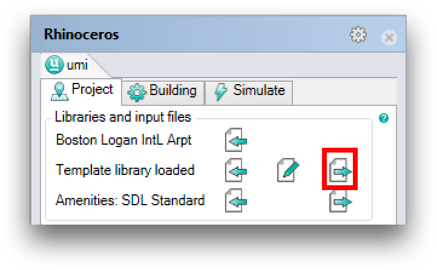

Saving a Project
================

All umi project geometry, settings, and simulation results are stored in a single .umi file called an umi bundle. The location of the bundle is specified when you create a new project, and whenever you save your Rhino document, this bundle is re-exported automatically in the background. The bundle includes the project's Rhino scene file, the epw weather file, building modeling templates as well as all simulation results in an SQLite data base, so you don't need to include those separately if you transfer the bundle to a different computer.

.. note::

   Please note that an *.umi file is just a compressed Windows.zip file, meaning that you can access all data related to your project directly. The purpose of the bundle is to streamline your workflow and to share and archive project data.

If you wish to change the location of the current umi bundle, use the UmiBundleSaveAs Rhino command. There is no toolbar button to invoke this command - you have to type it manually into the Rhino command window.

To export a copy of the current umi bundle without making it the "working" copy, use the UmiBundleSaveCopy Rhino command. Like the UmiBundleSaveAs command, there is no toolbar button for this command, and you will have to type it in yourself.

To export a project's building template library, use the "Export" button of the umi site settings tab:

To export a project's geometry, use the standard Rhino SaveAs command (this is the command invoked by selecting File > Save As... from the Rhino menubar). **The project's working Rhino document will change, and standard geometry saves will now modify this new version.**
