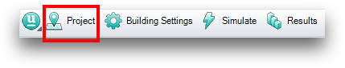
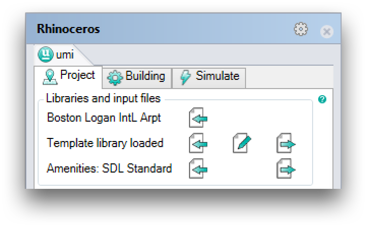
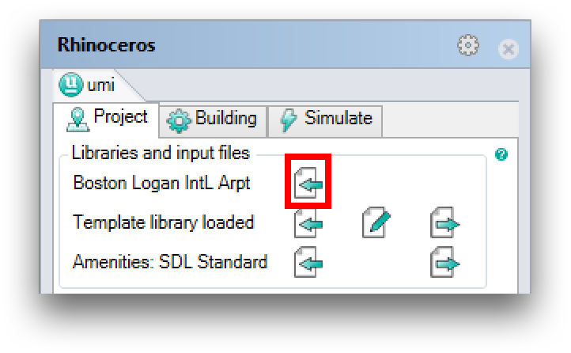
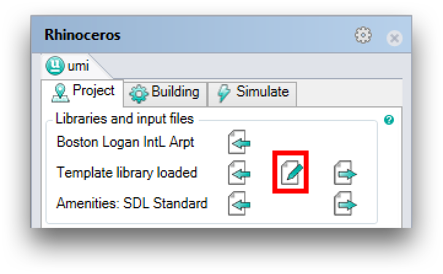

Configuring Site Parameters
===========================

To configuring your project's parameters, click the "Project" button in
the umi toolbar:

The umi panel opens, with the "Project" tab active:

Note that new projects use the Boston Logan Airport weather file, a
default template library, and the default amenities profile. Within umi,
blue text indicates default values.

To select a new weather file, click the "Import" button:

Navigate to and choose your desired `EnergyPlus weather (.epw)
file <https://energyplus.net/weather>`__. Notice how the location text
is not blue after a new file has been chosen.

To customize your building templates, click the "Edit" button:

The template editor will open. Make any changes you desire, and remember
to save! Notice how the template library text is not blue after changes
are made. Whole template libraries can also imported into and exported
from umi projects. Watch out - existing changes will be overwritten when
this happens!

The third setting allows you to provide a custom "amenities profile" for
mobility calculations. The default profile is usually sufficient, but to
learn about providing a custom profile, see
:ref:`design_access`.
