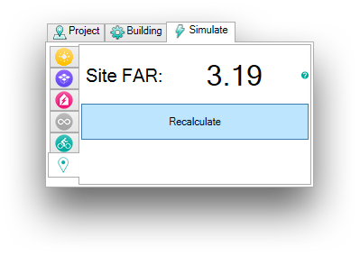

.. _site-stats-far:

Site Statistics - FAR
=====================

Umi can calculate a site's Floor Area Ratio (FAR), which is simply the ratio of the total gross floor area of each building on the site to the area the site itself occupies.

In order to perform an FAR calculation, two criteria must be satisfied. First, a floor-to-floor height for every building on the Buildings layer must be set, which requires that each has a building template assigned, as well. See Model Setup - Buildings for details. Second, a ground surface must exist on the "Ground" layer. This must be a flat, closed surface. Multiple ground surfaces can be defined; their area will simply be added together.

The FAR calculation can be executed from with the umi panel's Simulate tab. It is located on the first simulation sub-panel. The "Recalculate" button will perform the calculation and display the result. The button simply executes the "UmiCalculateFAR" Rhino command, which can also be directly invoked.

FAR results are never saved within the umi bundle, and must be recalculated (if desired) every time a project is reloaded.

.. raw:: html

   <iframe width="100%" max-height="315" height="315" src="https://www.youtube-nocookie.com/embed/X26KjwTy4pc?rel=0" frameborder="0" allowfullscreen></iframe>
