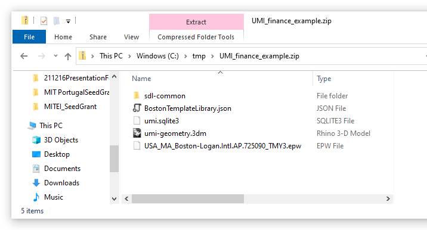

.. |br| raw:: html

    

.. _What is an UMI bundle?:

What is an UMI bundle?
======================

UMI stores all project information in a single file called an UMI bundle. The file has the extension FILE.UMI and has the format of a Microsoft Windows ZIP archive file. When you open an UMI bundle, the project content is extracted into a temporary directory on your computer. While you are working in UMI, files in that directory get updated and/or created. When an UMI project is saved, the directory content is saved back into the UMI bundle.

To access the content of an UMI bundle, rename the file extension to FILE.ZIP and open the file. A typical bundle content is shown below.

The main directory  contains the Rhino geometry file (.3dm), the climate file (.epw) and the template librabry (.json)> Under sdl-common other, project-specific files may be stored that belong to individual modules.  
